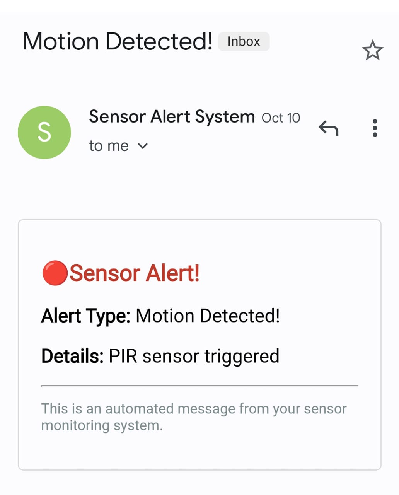
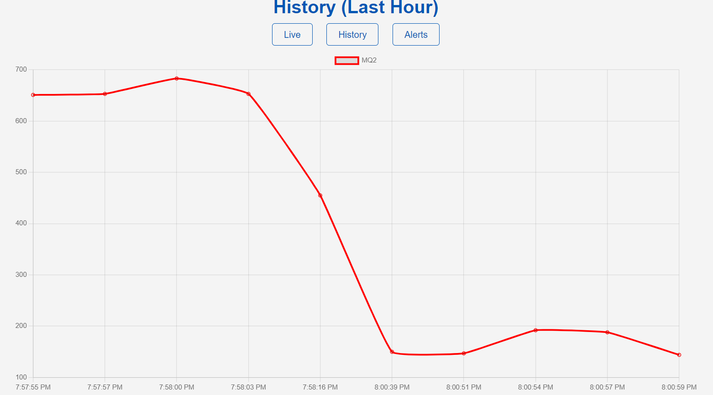
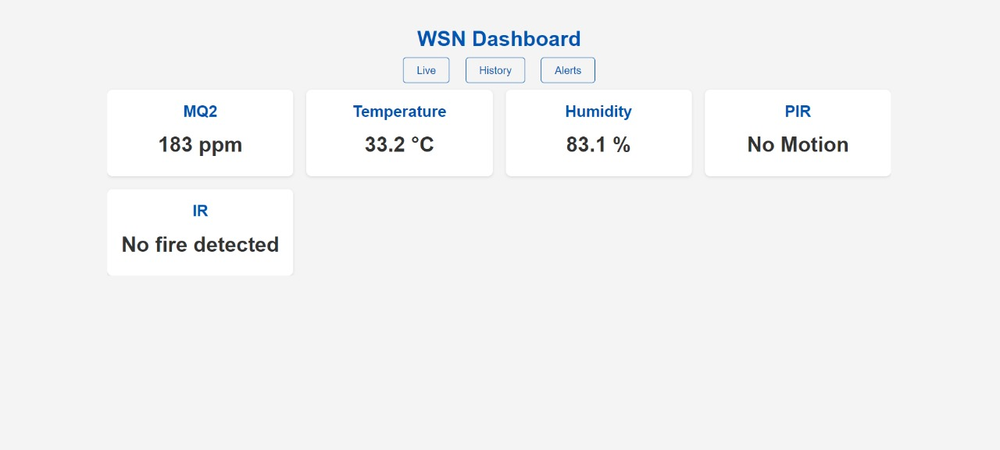
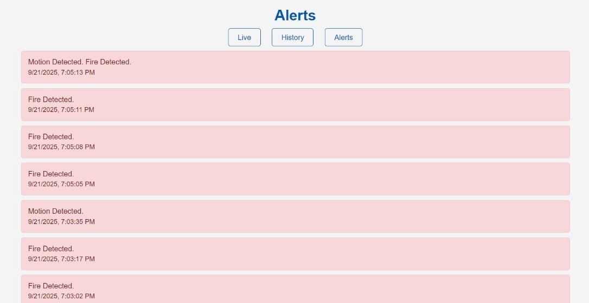
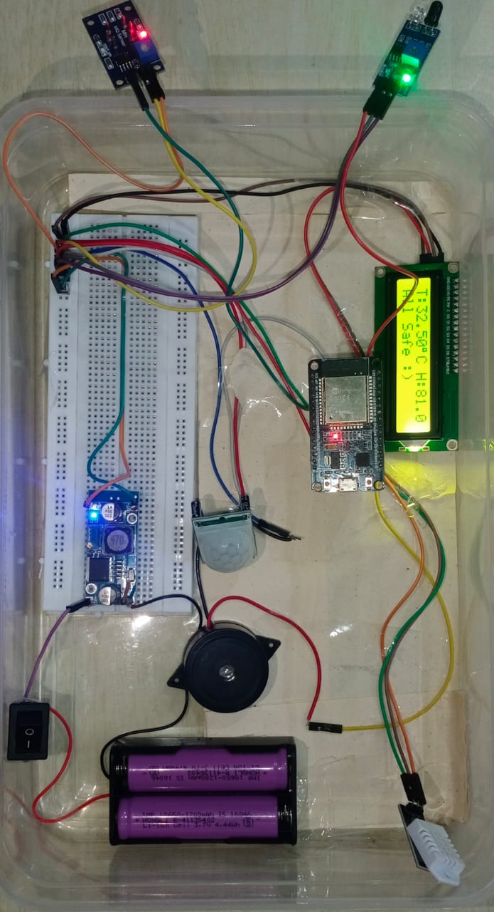

# 🌐 Wireless Sensor Network Based Smart Industrial Safety & Hazard Detection System

### 📅 Duration
August 2025 – October 2025

This is the backend repository for my final year project.

## 🧭 Project Overview
This project is using an ESP32 to collect real-time data from gas, temperature, motion, and flame sensors. 
A full-stack web dashboard, built with Node.js and MongoDB, provides live monitoring, historical data graphs, and a log of all triggered events. 
The system ensures immediate hazard response through an automated dual-alert system, featuring on-site buzzer alarms and instant email notifications.
**Check out the live frontend dashboard here:** [[Frontend Repo](https://github.com/yash1915/wsnfrontend) or [Demo](https://wsnfrontend.vercel.app/)]

---
## ⚙️ Hardware Components
- ESP32 Microcontroller (Wi-Fi enabled)  
- MQ-2 Gas Sensor  
- DHT22 Temperature & Humidity Sensor  
- Flame Sensor  
- PIR Motion Sensor  
- Buzzer  
- LCD Display

---

## 💻 Software & Tech Stack
|       Component         |              Technology            |
|-------------------------|------------------------------------|
| Frontend                | HTML, CSS, JavaScript              |
| Backend                 | Node.js, Express.js                |
| Database                | MongoDB                            |
| Real-time Communication | WebSocket                          |
| Embedded Programming    | C++ (ESP32)                        |
| Alerts                  | Nodemailer (Email), Buzzer (Local) |

---

## 🧩 System Architecture
[ Sensors ] → [ ESP32 ] → (Wi-Fi) → [ Node.js Server ] → [ MongoDB ] & [ WebSocket ] → [ Dashboard ]

---

##  Features
- ✅ Real-time monitoring of multiple sensors  
- ✅ Automatic email and buzzer alerts on threshold breaches  
- ✅ Web dashboard with live sensor readings  
- ✅ History log of triggered events in MongoDB  
- ✅ Scalable for multiple industrial zones
  
---

## The Problem 🎯

Industrial workplaces often face hidden hazards such as:
- Gas leaks  
- Overheating machinery  
- Unauthorized access
  
Traditional periodic safety checks **cannot detect these instantly**, putting workers and machinery at risk.

## Our Solution ✨

This system acts as a **digital nervous system** for a facility. It uses a network of sensors to constantly monitor the environment and provides three key features:
- **Live Monitoring:** Track all sensor readings in real-time  
- **Historical Data:** Analyze past events to identify patterns and risks  
- **Instant Alerts:** Receive immediate **email notifications** and **local buzzer alerts** when a hazard is detected
- 
---

## How It Works ⚙️

1. **Sensor Nodes:**  
   An ESP32 microcontroller collects data from sensors:  
   - Gas (MQ-2)  
   - Temperature & Humidity (DHT22)  
   - Motion (PIR)  
   - Flame  

2. **Data Transmission:**  
   Data is sent over Wi-Fi from ESP32 to the Node.js backend.

3. **Backend Processing:**  
   - Node.js/Express server stores data in **MongoDB**  
   - Uses **WebSockets** to push real-time updates to the dashboard  
   - Sends **email alerts** on threshold breaches  

4. **Dashboard:**  
   Frontend visualizes live readings, historical trends, and alert logs.

---

## A Look Inside the Project 📸

| Sensor Triggered Email                         | History & Trends Page                         | 
|------------------------------------------------|-----------------------------------------------|
|                |                 |

|  Live Monitoring Dashboard                     | Alerts Log                                    |
|------------------------------------------------|-----------------------------------------------|
|   |                    |

| Hardware Prototype                 |
|------------------------------------|
|    |

 

---

  ## Future Enhancements
  - Integrate AI-based predictive hazard detection to forecast risks before they occur.
  - Enable cloud hosting and dashboard access for large-scale industrial deployments.
  - Implement data analytics and machine learning for long-term trend analysis and preventive maintenance.
    
---

## 🏁 Conclusion
This project demonstrates **end-to-end IoT system integration**:  
from **hardware sensors** to **real-time data visualization** and **automated alerts**.  
It highlights skills in **embedded systems, full-stack web development, real-time communication, and database management**.

---

## Running It Locally

To get this backend running on your own machine:

1.Clone the repositories:
- Frontend: `git clone https://github.com/yash1915/wsnfrontend.git`
- Backend: `git clone https://github.com/yash1915/wsnbackend.git`
2.  **Install dependencies:** `npm install`
3.  **Set up your `.env` file:** You'll need to add your MongoDB connection string and email credentials.
4.  **Start it up:** `npm run dev`
